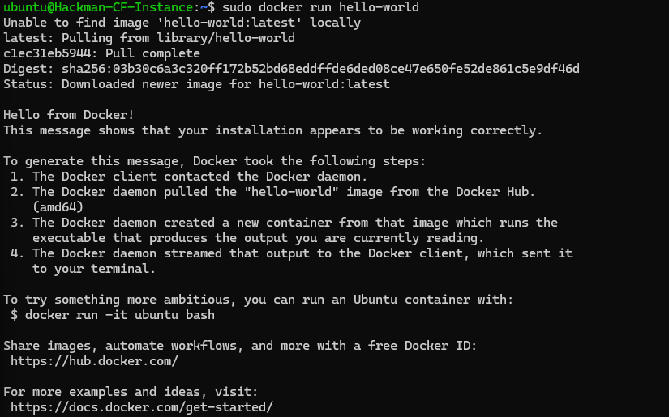
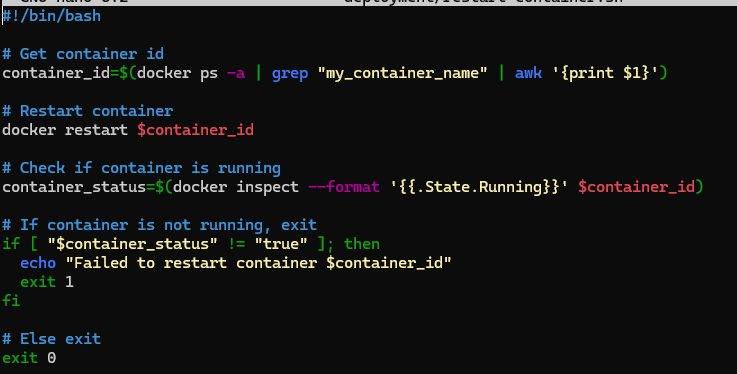

CD Project Overview
 - The objective of this project was to 

How to generate a tag in git / GitHub
 - git tag v1.0.0
 - Identify the current state of the repo as whatever it is named as
 - Usually tag at v1.0,v2.0, etc
 - tag specific points in a repository’s history as being important

Behavior of GitHub workflow
 - what does it do and when
   - Starts by making sure the version is v*.*.* (v1.0.0, v1.0.2, etc)
   - Sets up the job
   - Checks out the repo
   - Grabs Meta Data
     - Takes the tags generated from github and routes them to Docker
     - Uses type=semver,pattern={{version}} to apply the version to the docker tag
   - Login to Docker Hub using the login information given by the secrets
   - Pushes the image to Docker Hub
   - Back tracks and logs back out

 
Link to your DockerHub repository
https://hub.docker.com/r/snakeman23/project4

How to install Docker to your instance
 - Installs Docker
   - sudo apt install docker.io
 - Install all the dependency packages
   - sudo snap install docker
 - Run Hello world
   - sudo docker run hello-world

Container restart script 
- Located in deployment folder
- Restarts the container based on the container name provided
- If its not running, it doesn't restart anything and fails.
- Else it restarts

Setting up a webhook listener on the instance

 - How to install adnanh's webhook to the instance
   - 
 - webhook task definition file

Description of what it does
Where it should be on the instance (if someone were to use your setup)
ADD your webhook definition file to your repository
How to start the webhook

How to modify/ create a webhook service file such that your webhook listener is listening as soon as the system is booted

include commands to reload the service respective to files changed (webhook service file versus hook definition file)
ADD your webhook service file to your repository
How to configure GitHub OR DockerHub to message the listener

Provide proof that the CI & CD workflow work. This means:

starting with a commit that is a change, taging the commit, pushing the tag
Showing your GitHub workflow returning a message of success.
Showing DockerHub has freshly pushed images.
Showing the instance that you are deploying to has webhook logs indicating the payload was recieved and the container has updated.