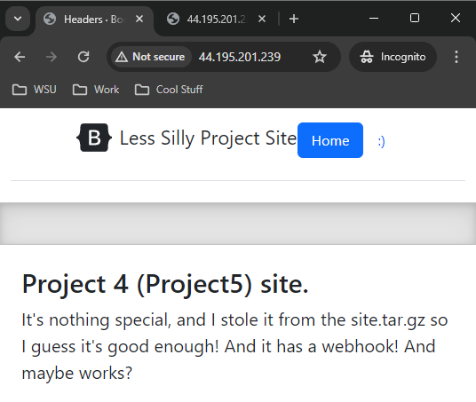

CD Project Overview
 - The objective of this project was to prepare a webhook so changes I make to the website in github will update docker and have that change show up on the website by restarting the container
 - See diagram for workflow

 

How to generate a tag in git / GitHub
 - git tag v1.0.0
 - Identify the current state of the repo as whatever it is named as
 - Usually tag at v1.0,v2.0, etc
 - tag specific points in a repository’s history as being important

Behavior of GitHub workflow
 - what does it do and when
   - Starts by making sure the version is v*.*.* (v1.0.0, v1.0.2, etc)
   - Sets up the job
   - Checks out the repo
   - Grabs Meta Data
     - Takes the tags generated from github and routes them to Docker
     - Uses type=semver,pattern={{version}} to apply the version to the docker tag
   - Login to Docker Hub using the login information given by the secrets
   - Pushes the image to Docker Hub
   - Back tracks and logs back out

 
Link to your DockerHub repository
https://hub.docker.com/r/snakeman23/project4

How to install Docker to your instance
 - Installs Docker
   - sudo apt install docker.io
 - Install all the dependency packages
   - sudo snap install docker
 - Run Hello world
   - sudo docker run hello-world

Container restart script 
- Located in deployment folder
- Restarts the container based on the container name provided
- If its not running, it doesn't restart anything and fails.
- Else it restarts

Setting up a webhook listener on the instance
 - How to install adnanh's webhook to the instance
   - sudo apt-get install webhook
 - webhook task definition file
   - "id": "restart-container",
   -   "execute-command": "/home/ubuntu/deployment/restart-container.sh",
   - "command-working-directory": "/home/ubuntu"
  

Description of what it does
 - hooks.json located in the home folder
 - When it gets a signal, runs the container restart file labeled restart-container.sh
 - Stops, removes, and restarts the container
 - Can be manually started by going to http://44.195.201.239:9000/hooks/restart-container
 - Is started by running the following: webhook -hooks hooks.json -verbose
 - This looks for the webhook signal to trigger the restart script

Proof that the CI & CD workflow work. 
 - Commit that is a change, taging the commit, pushing the tag
   - Ignore the mistype of v1.1.6
   - I added a second similey face to show up on a button that was originally labeled home
   -  Looks like :D

GitHub workflow returning a message of success.
  - Workflow from project 4 gave all checkmarks

Showing DockerHub has freshly pushed images.
 - Both latest and 1.1.7 is updated

Showing the instance that you are deploying to has webhook logs 
  - Webhook is started and signal watcher starts
  - Webhook receives a request
  - Starts the restart-container.sh and restarts the site

Payload was recieved and the container has updated
  - Before the push

  

  - After the push

  
