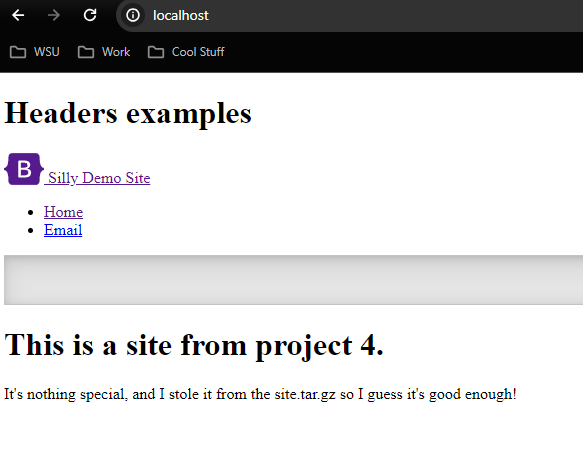

CI Project Overview
 - The objective of this project was to setup  an application in docker and utilize github to automate updating our apache2 website.

 Install Docker
 - Install docker desktop since we are on windows 11
 - Once installed, enable Use the WSL 2 based engine 
 - Open ubuntu and install docker via sudo apt install docker

 Build Image 
 - To build the docker file, I creaated a file labeled Dockerfile and inputted the following
  - FROM httpd:latest
  - COPY index.html /usr/local/apache2/htdocs
  - EXPOSE 80
 - This setups the file to use the apache2 image prebuilt for us
 - It then utilizes the index file I created/stole from tar.site.gz
 - Lastly, it opens port 80 for docker to run on

 Run Container
  - To run the container, I used the following command
  - docker run -d --name site -p 80:80 site:v1
  - This runs the container named site and puts it on port 80

 View Project
  - To view the site, I went to localhost:80 
  - Gives us the following 
  