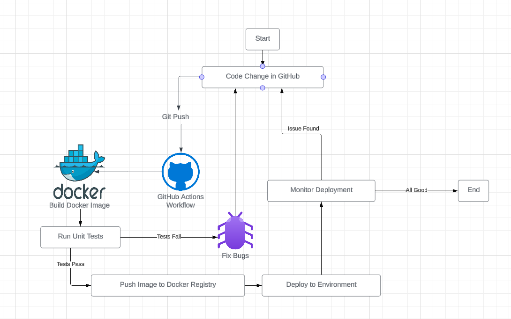
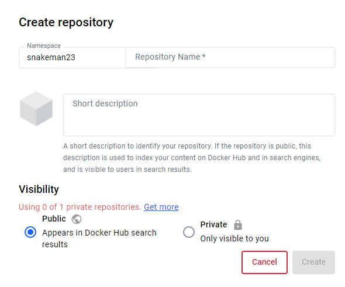
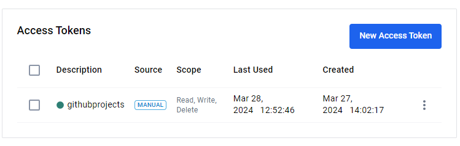

CI Project Overview
 - The objective of this project was to setup  an application in docker and utilize github to automate updating our apache2 website.

 

 Install Docker
 - Install docker desktop since we are on windows 11
 - Once installed, enable Use the WSL 2 based engine 
 - Open ubuntu and install docker via sudo apt install docker

 Build Image 
 - To build the docker file, I creaated a file labeled Dockerfile and inputted the following
  - FROM httpd:latest
  - COPY index.html /usr/local/apache2/htdocs
  - EXPOSE 80is a site from project 4.
  It's nothing special, and I stole it from the site.tar.gz so I guess it's good 
 - This setups the file to use the apache2 image prebuilt for us
 - It then utilizes the index file I created/stole from tar.site.gz
 - Lastly, it opens port 80 for docker to run on

 Run Container
  - To run the container, I used the following command
  - docker run -d --name site -p 80:80 site:v1
  - This runs the container named site and puts it on port 80

 View Project
  - To view the site, I went to localhost:80 whcih gives us the following 
  

GitHub Actions and DockerHub

Process to create public repo in DockerHub
 - To create a public repo, select Create Repository in Docker
 - Give it a name and short description
 - Select Public
 - Select create 

How to authenticate with DockerHub via CLI using Dockerhub credentials
 - Will need to get a token so we can sign into docker via cli
 - Select Profile
 - Select My Account
 - Click on security
 - Select New Access Token
 - Create the token by selecting the Name and Scope, then click create
 - Note the token so you can put it in github secrets
 

How to push container image to Dockerhub (without GitHub Actions)
 - docker push Username/project4:tagname

Link to your DockerHub repository
https://hub.docker.com/r/snakeman23/project4

Configuring GitHub Secrets
 - How to set a secret
  - On github, select settings
  - Select Security -> Secrets and Variables
  - Select actions
  - Click on New Repository Secret
 
 What secret(s) are set for this project
  - DOCKER_PASSWORD
  - DOCKER_USERNAME

Behavior of GitHub workflow
 - what does it do and when
   - Sets up the job
   - Checks out the repo
   - Login to Docker Hub using the login information given by the secrets
   - Pushes the image to Docker Hub
   - Back tracks and logs back out

 - Workflow file
   - other than the hardcoded tag, everything is avaible to use for other projects
   - uses the github secrets for the username and password
